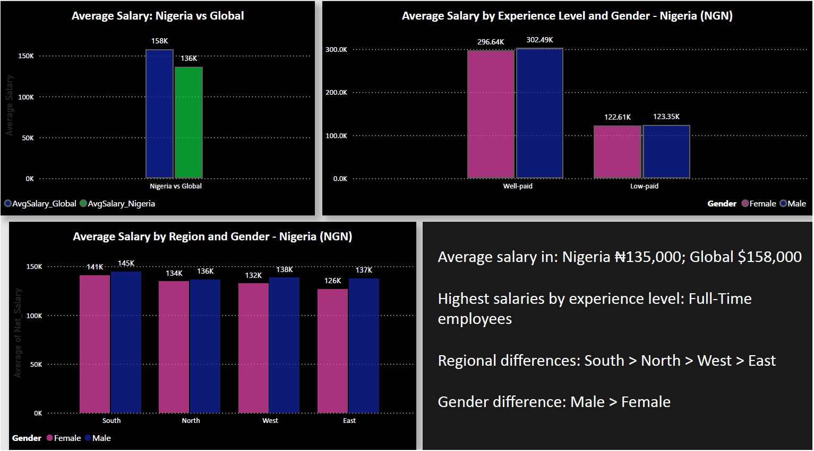

📊 # Salary Analysis Dashboard (Power BI)

This project explores salary trends across regions, genders, and experience levels. The goal was to create a clear and interactive dashboard that highlights the difference between salaries in Nigeria and global earnings.

---

📌 ## Project Overview

The dashboard provides insights into:

- Average salary in Nigeria and globally

- Salary differences by gender

- Earnings by experience level

- Regional salary distribution within Nigeria

- Quick insights displayed through KPI cards

Each visual was designed to help users understand salary patterns in a simple and meaningful way.

---

🧹 ## Data Cleaning and Preparation

All cleaning was done in Power Query.

Key steps included:

- Handling missing entries

- Converting salary values to proper numerical formats

- Standardizing region names

- Removing duplicates and unwanted fields

- Creating calculated fields to support analysis

These steps ensured that all visuals and metrics remained accurate.

---

📈 ## Dashboard Features

**KPI Cards**

- Average Salary (Nigeria)

- Average Salary (Global)

- Salary by Gender

- Salary by Experience Level

- Salary by Region

**Charts and Visuals**

- Nigeria vs Global salary comparison

- Salary by gender

- Salary by experience

- Salary distribution across regions

Clean layout with interactive filters

---

🛠 ## Tools Used

- **Power BI Desktop**

- **Power Query**

- **DAX**

- **Data modelling**

---

📷 ## Dashboard Preview

---

📁 ## How to Use This Project

1. Download the .pbix file from this repository

2. Open it in Power BI Desktop

3. Explore the visuals and interactions

---

📚 ## Dataset Source

The dataset was used for educational and analysis purposes only.

---

🤝 ## About the Project

- This project helped develop practical experience in:

- Cleaning and preparing data

- Building analytical dashboards

- Transforming raw data into useful insights

- Communicating patterns visually

---

🔗 ## Connect With Me

Feel free to share suggestions or reach out on GitHub or LinkedIn.
